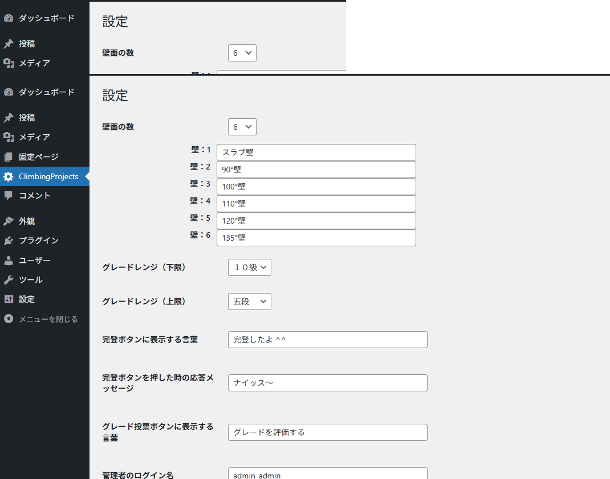

#
# 1. インストール方法
*注意）* 店舗PCにインストールして、FiWi経由でユーザに公開する場合、無線ルータやアクセスポイントなどでアクセス制限を行っているとエラーになってしまいます。その場合は適切に通信許可の設定をしてください。
### a)Local/WordPressのインストール
[このサイト（www.kagoya.jp）](https://www.kagoya.jp/howto/rentalserver/wppractice/wp_local/)を参考にPCにLocal/WordPressをインストール

・Localをダウンロード・インストール

・LocalでWordPressをインストール

・WordPressのダッシュボードへログイン

#
### b)プラグインのインストール
### ・プラグインのダウンロード
[GitHub](https://github.com/AkihisaKojima/ClimbingProject/)にアクセスします。
表示されてた画面の「<> Code」をクリックし、一番下の「Download ZIP」をクリックしてプラグインをダウンロードします。

### ・プラグインをWordPressにインストール
Wordpressのダッシュボードへログイン（管理者権限）します。（ダッシュボードへログインするにはLocalの「WP Admin」をクリックするとログイン画面が表示されます）

ダッシュボードへログインできたら、メニューから「プラグイン」ー「プラグインの追加」を選択。表示された画面の「プラグインのアップロード」をクリックします。「ファイルを選択」をクリックして、ダウンロードしたプラグイン（ZIPファイル）を選択し、「今すぐインストール」をクリックします。プラグイン一覧に「ClimbingProject」が表示されたらインストール成功です。ClimbingProjectの「有効化」をクリックして有効化しましょう。

#
### c)初期設定
### ・Wordpressの初期設定
ダッシュボードから、「Settings」ー「general」を選択。設定項目で、「Site Language」を「*日本語*」に。「Timezone」を「*Tokyo*」に変更します。変更できたら、最下部の「Save Changes」をクリックします。表示が日本語に変われば成功です。

### ・テーマの設定

#
# 2. 利用方法
### a)管理者
### 　　初期設定

### 　　壁画像のアップロード
### b)ユーザ
### 　　課題の検索
### 　　課題作成
